# PortfolioGuard Backend

A sophisticated multi-agent system for Hedera network portfolio management and risk analysis, built with TypeScript and powered by Agent-to-Agent (A2A) communication architecture.

## 🏗️ Project Overview

PortfolioGuard is a sophisticated, enterprise-grade portfolio monitoring and risk analysis system specifically designed for the Hedera Hashgraph ecosystem. Built on a cutting-edge multi-agent architecture, the system employs specialized AI agents that work collaboratively to provide real-time portfolio insights, risk assessments, and market intelligence.

### Core Architecture Philosophy

The system is built around three fundamental principles:

1. **Agent Specialization**: Each agent has a single, well-defined responsibility, ensuring optimal performance and maintainability
2. **Asynchronous Communication**: All inter-agent communication happens through a centralized A2A (Agent-to-Agent) message bus, enabling real-time coordination
3. **Hedera-Native Integration**: Deep integration with Hedera SDK and Agent Kit for seamless blockchain operations

### Detailed System Capabilities

#### 🔍 **Portfolio Intelligence**
- **Multi-Account Monitoring**: Simultaneously track multiple Hedera accounts (0.0.xxxxx format)
- **Real-time Balance Tracking**: Instant updates on HBAR and HTS token balances
- **Historical Analysis**: Track portfolio performance over time with detailed metrics
- **Risk Scoring**: AI-powered risk assessment based on portfolio composition and market conditions

#### 📊 **Market Intelligence**
- **Sentiment Analysis**: Real-time analysis of X (Twitter) sentiment for Hedera-related topics
- **News Aggregation**: Automated collection and analysis of crypto news affecting portfolio assets
- **Trend Detection**: Identify emerging market trends that could impact portfolio performance
- **Alert System**: Proactive notifications for significant market events or portfolio changes

#### 🤖 **AI-Powered Insights**
- **Natural Language Queries**: Ask questions about your portfolio in plain English
- **Predictive Analytics**: AI-driven predictions for portfolio performance and risk factors
- **Automated Recommendations**: Intelligent suggestions for portfolio optimization
- **Address Analysis**: Deep analysis of any Hedera account for due diligence

#### 🔗 **Hedera Ecosystem Integration**
- **HTS Token Support**: Full support for Hedera Token Service (HTS) tokens
- **Smart Contract Interaction**: Ready for integration with Hedera smart contracts
- **Multi-Network Support**: Configurable for both testnet and mainnet environments
- **Account Discovery**: Automatic detection of new tokens and account activities

### Agent Communication Flow

```mermaid
graph TB
    User[👤 User] --> ChatAgent[🗨️ Chat Agent]
    
    subgraph "A2A Message Bus"
        Bus[📡 Central Message Bus<br/>Event-Driven Communication]
    end
    
    subgraph "Core Agents"
        ChatAgent --> Bus
        PortfolioAgent[📊 Portfolio Agent] --> Bus
        WalletAgent[💰 Wallet Agent] --> Bus
        LLMAgent[🤖 Hedera LLM Agent] --> Bus
    end
    
    subgraph "Data Agents"
        XTrendAgent[📈 XTrend Agent] --> Bus
        ScannerAgent[🔍 Scanner Agent] --> Bus
        GraphAgent[📉 Graph Agent] --> Bus
    end
    
    subgraph "External Services"
        HederaNetwork[🌐 Hedera Network<br/>Testnet/Mainnet]
        TwitterAPI[🐦 X Twitter API]
        NewsAPI[📰 News API]
        OpenAI[🧠 OpenAI GPT-4]
    end
    
    Bus --> ChatAgent
    Bus --> PortfolioAgent
    Bus --> WalletAgent
    Bus --> LLMAgent
    Bus --> XTrendAgent
    Bus --> ScannerAgent
    Bus --> GraphAgent
    
    WalletAgent --> HederaNetwork
    PortfolioAgent --> HederaNetwork
    LLMAgent --> HederaNetwork
    LLMAgent --> OpenAI
    XTrendAgent --> TwitterAPI
    XTrendAgent --> NewsAPI
    ScannerAgent --> HederaNetwork
    
    ChatAgent --> User
    
    classDef userClass fill:#e1f5fe
    classDef agentClass fill:#f3e5f5
    classDef busClass fill:#fff3e0
    classDef externalClass fill:#e8f5e8
    
    class User userClass
    class ChatAgent,PortfolioAgent,WalletAgent,LLMAgent,XTrendAgent,ScannerAgent,GraphAgent agentClass
    class Bus busClass
    class HederaNetwork,TwitterAPI,NewsAPI,OpenAI externalClass
```



### Message Flow Examples

#### Portfolio Risk Assessment Flow


#### Real-time Monitoring Flow


### Key Features

- **Real-time Portfolio Monitoring**: Track HBAR and token balances across Hedera accounts with sub-second latency
- **AI-Powered Risk Analysis**: Machine learning-driven risk assessment based on market sentiment, portfolio composition, and historical patterns
- **Multi-Source News Integration**: X (Twitter) and NewsAPI integration for comprehensive market sentiment analysis
- **Distributed Agent Architecture**: 7 specialized agents working in harmony for optimal performance and reliability
- **Native Hedera Integration**: Direct integration with Hedera SDK and Agent Kit for seamless blockchain operations
- **Scalable Communication**: Event-driven A2A message bus supporting horizontal scaling and fault tolerance

## 🤖 Agent Architecture

The system consists of 7 specialized agents that communicate via the A2A message bus:

### 1. **Chat Agent** (`chatAgent.ts`)
- **Purpose**: Handles user interactions and chat-based queries
- **Responsibilities**: Process user commands, coordinate with other agents
- **A2A Messages**: Receives user queries, sends responses

### 2. **Portfolio Agent** (`portfolioAgent.ts`)
- **Purpose**: Monitors user portfolios and generates risk assessments
- **Responsibilities**: Track balance changes, calculate risk scores, generate alerts
- **A2A Messages**: Sends `balance_update`, `risk_summary` messages

### 3. **Wallet Agent** (`walletAgent.ts`)
- **Purpose**: Manages wallet operations and account interactions
- **Responsibilities**: Account balance queries, transaction monitoring
- **A2A Messages**: Handles wallet-related requests

### 4. **XTrend Agent** (`newsAgent.ts`)
- **Purpose**: Monitors X (Twitter) for market sentiment and news
- **Responsibilities**: Fetch trending topics, analyze sentiment, send alerts
- **A2A Messages**: Sends `x_news_alert` messages with sentiment data

### 5. **Graph Agent** (`graphAgent.ts`)
- **Purpose**: Generates portfolio visualization data
- **Responsibilities**: Create charts, graphs, and visual representations
- **A2A Messages**: Responds to `graph_request` with `graph_ready` data

### 6. **Hedera LLM Agent** (`hederaLLMAgent.ts`)
- **Purpose**: AI-powered analysis and natural language processing
- **Responsibilities**: Address analysis, portfolio insights, user query responses
- **A2A Messages**: Handles `llm_query`, sends `llm_response`

### 7. **Scanner Agent** (`scannerAgent.ts`)
- **Purpose**: Automated portfolio scanning and discovery
- **Responsibilities**: Scan accounts, detect new tokens, monitor changes
- **A2A Messages**: Sends `scan_request` and processes scan results

## 🔄 A2A Communication System

### Message Bus Architecture

The A2A (Agent-to-Agent) communication system is implemented in `utils/bus.ts` and provides:

```typescript
class A2ABus extends EventEmitter {
  // Agent registration and management
  registerAgent(agentName: string): void
  unregisterAgent(agentName: string): void
  
  // Message sending and routing
  sendMessage(message: A2AMessage): void
  
  // Response coordination
  waitForResponses(messageId: string, expectedAgents: string[], timeout?: number): Promise<A2AMessage[]>
  
  // System monitoring
  getMessageHistory(): A2AMessage[]
  getRegisteredAgents(): string[]
}
```

### Message Types

The system defines several message types for inter-agent communication:

- **`x_news_alert`**: Market sentiment and news updates
- **`balance_update`**: Portfolio balance changes
- **`risk_summary`**: Risk analysis results
- **`scan_request`**: Portfolio scanning requests
- **`graph_request`**: Data visualization requests
- **`graph_ready`**: Chart/graph data responses
- **`llm_query`**: AI analysis requests
- **`llm_response`**: AI-generated insights

### Communication Flow Example

```
User Query → Chat Agent → LLM Agent → Portfolio Agent → Response
     ↓              ↓           ↓              ↓
   A2A Bus    llm_query   analysis    balance_update
```

## 🌐 Hedera Network Integration

### Hedera SDK Usage

The project integrates with Hedera Hashgraph through the official `@hashgraph/sdk`:

```typescript
// Configuration (config/hedera.ts)
const client = NETWORK === 'mainnet' ? Client.forMainnet() : Client.forTestnet();
client.setOperator(HEDERA_OPERATOR_ID, HEDERA_OPERATOR_KEY);

// Account Operations (utils/hedera.ts)
- resolveAccountId(): Convert addresses to AccountId
- detectTokensForAccount(): Find tokens held by account
- getAccountHoldings(): Get complete portfolio data
```

### Hedera Agent Kit Integration

While the project includes `hedera-agent-kit` as a dependency, the current implementation primarily uses the core Hedera SDK directly. The Hedera Agent Kit provides additional utilities for:

- **Smart Contract Interactions**: Deploy and interact with Hedera smart contracts
- **Token Operations**: Create, mint, and manage HTS tokens
- **Advanced Account Management**: Multi-signature and complex account operations

The LLM Agent (`hederaLLMAgent.ts`) is designed to leverage these capabilities for advanced portfolio operations:

```typescript
// Hedera client initialization in LLM Agent
if (process.env.HEDERA_OPERATOR_ID && process.env.HEDERA_OPERATOR_KEY) {
  this.client = Client.forTestnet(); // or forMainnet()
  this.client.setOperator(operatorId, privateKey);
}
```

## 🚀 Getting Started

### Prerequisites

- Node.js 18+
- TypeScript
- Hedera testnet/mainnet account (optional)
- OpenAI API key
- X (Twitter) API bearer token (optional)
- NewsAPI key (optional)

### Installation

1. **Clone and install dependencies**:
```bash
cd backend
npm install
```

2. **Environment Configuration**:
```bash
cp .env.example .env
# Edit .env with your API keys and configuration
```

3. **Required Environment Variables**:
```env
# Hedera Configuration
HEDERA_NETWORK=testnet
HEDERA_OPERATOR_ID=0.0.xxxxx
HEDERA_OPERATOR_KEY=302e020100300506032b657004220420...

# AI Integration
OPENAI_API_KEY=your_openai_api_key

# News Integration (Optional)
X_BEARER_TOKEN=your_twitter_bearer_token
NEWSAPI_KEY=your_newsapi_key

# Server Configuration
PORT=3000
ENABLE_X_DATA=true
```

### Running the Application

```bash
# Development mode
npm run dev

# Production build
npm run build
npm start
```

### API Endpoints

- **`GET /`**: Health check
- **`GET /swarm/status`**: Agent swarm status
- **`GET /swarm/health`**: System health check
- **`POST /api/chat`**: Chat interface for user queries

## 🔧 Architecture Benefits

### 1. **Modularity**
Each agent has a single responsibility, making the system easy to maintain and extend.

### 2. **Scalability**
Agents can be distributed across multiple processes or servers as needed.

### 3. **Fault Tolerance**
If one agent fails, others continue operating independently.

### 4. **Real-time Communication**
A2A message bus enables instant communication between agents.

### 5. **Extensibility**
New agents can be added without modifying existing code.

## 🔮 Future Enhancements

- **Enhanced Hedera Agent Kit Integration**: Leverage more advanced features for smart contract interactions
- **Multi-Network Support**: Extend beyond Hedera to other networks
- **Advanced AI Capabilities**: More sophisticated portfolio analysis and predictions
- **Mobile App Integration**: React Native app for mobile portfolio monitoring
- **DeFi Integration**: Support for DeFi protocols on Hedera

## 📁 Project Structure

```
backend/
├── src/
│   ├── agents/           # Individual agent implementations
│   ├── config/           # Configuration files
│   ├── routes/           # Express.js routes
│   ├── services/         # Business logic services
│   ├── store/            # Data storage and user management
│   ├── swarm/            # Agent orchestration
│   └── utils/            # Utility functions and A2A bus
├── package.json          # Dependencies and scripts
├── tsconfig.json         # TypeScript configuration
└── .env.example          # Environment variables template
```

## 🤝 Contributing

1. Fork the repository
2. Create a feature branch
3. Implement your changes
4. Add tests if applicable
5. Submit a pull request

## 📄 License

This project is licensed under the MIT License - see the LICENSE file for details.